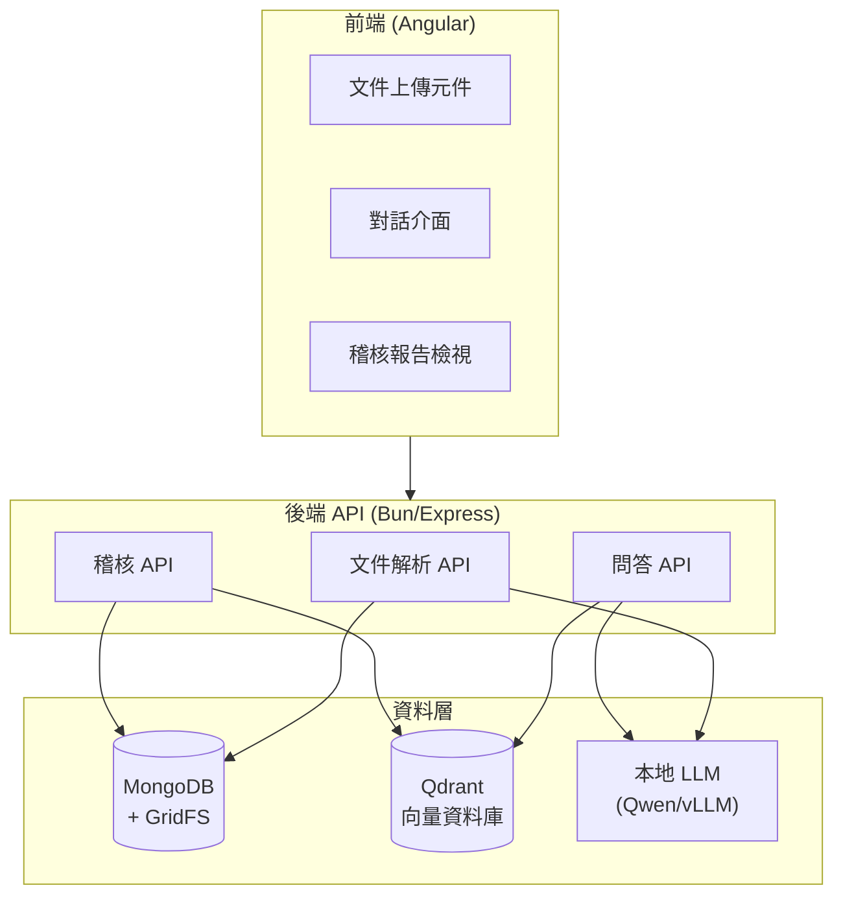
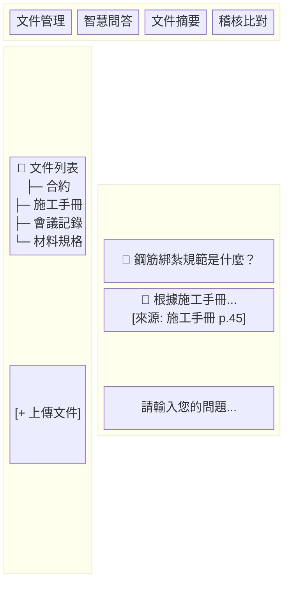

# 2026 AI 功能規格建議書

## 一、專案背景

工地專案管理系統目前累積大量文件資料，包含：
- 會議記錄
- 內部施工手冊
- 材料規格書
- 客戶合約
- 各類表單（許可單、管制單、缺失單等）

這些文件格式多元（PDF、Word、純文字檔），目前仰賴人工閱讀與整理，耗費大量時間。本規格書提出 AI 輔助功能，協助行政人員與專案經理提升工作效率。

---

## 二、目標使用者

| 角色 | 主要需求 |
|------|----------|
| 行政人員 | 文件整理、資料歸檔、快速查找 |
| 專案經理 | 進度追蹤、稽核對比、決策支援 |
| 工安人員 | 規範查詢、缺失比對、風險評估 |

---

## 三、核心功能模組

### 3.1 文件智慧解析引擎

#### 功能說明
- 支援上傳 PDF、Word (.docx)、純文字檔 (.txt)
- 自動擷取文件內容並結構化儲存
- OCR 光學字元辨識（處理掃描檔或圖片型 PDF）

#### 技術規格
```
支援格式：PDF, DOCX, TXT, JPG, PNG
檔案大小限制：單檔 50MB
文件解析引擎：Qwen3-VL（建議）
儲存方式：MongoDB + GridFS（原檔） + 向量資料庫（語意索引）
```

#### 為何選擇 Qwen3-VL
相較於傳統 OCR（Tesseract）或雲端服務（Azure Document Intelligence），Qwen3-VL 視覺語言模型具備以下優勢：

| 特性 | 說明 |
|------|------|
| 中文辨識能力強 | 針對繁體中文文件表現優異 |
| 複雜版面理解 | 可處理表格、圖表、混合排版 |
| 不只是 OCR | 同時理解文件語意，可直接進行問答 |
| 本地部署 | 資料不外送，符合資安需求 |
| 開源免費 | 無 API 呼叫費用，僅需 GPU 資源 |

**部署需求**
```
GPU：NVIDIA RTX 4090 或 A100（建議）
VRAM：24GB 以上
推理框架：vLLM（生產環境） / Ollama（快速部署）
```

---

### 3.2 智慧搜尋與問答系統 (RAG)

#### 功能說明
- 語意搜尋：以自然語言查詢文件內容
- 問答對話：針對已上傳文件進行問答
- 來源標註：回答時標示資料來源與頁碼

#### 使用情境
```
問：「鋼筋綁紮的施工規範有哪些要求？」
答：「根據《施工手冊 v3.2》第 45 頁，鋼筋綁紮須符合以下規範：
     1. 主筋間距不得超過 15cm...
     2. 箍筋須採用 #4 以上規格...」
     [來源: 施工手冊_v3.2.pdf, 第45-47頁]
```

#### 技術規格
```
向量資料庫：Qdrant（本地部署）
嵌入模型：bge-m3 / bge-large-zh-v1.5（中文優化）
LLM：Qwen2.5-32B-Instruct（建議）
Chunk 策略：500-1000 tokens，overlap 100 tokens
推理框架：vLLM（生產環境） / Ollama（快速部署）
```

---

### 3.3 文件摘要與重點提取

#### 功能說明
- 會議記錄摘要：自動產生會議重點、待辦事項、決議事項
- 合約摘要：擷取關鍵條款、履約期限、罰則規定
- 施工手冊摘要：整理施工步驟、注意事項、安全規範

#### 輸出格式
```markdown
## 會議摘要 - 2026/01/15 工程進度會議

### 重要決議
1. 二期工程預計 2/1 開工
2. 材料採購需於 1/25 前完成

### 待辦事項
| 項目 | 負責人 | 期限 |
|------|--------|------|
| 鋼筋數量確認 | 王主任 | 1/20 |
| 安全圍籬設置 | 李工程師 | 1/22 |

### 下次會議
- 時間：2026/01/22 14:00
- 地點：工務所會議室
```

---

### 3.4 稽核比對功能

#### 功能說明
- **合約 vs 執行比對**：檢查實際施工是否符合合約規定
- **規範 vs 現況比對**：對照施工手冊檢查缺失
- **材料規格驗證**：比對進場材料與規格書要求

#### 稽核報告產出
```markdown
## 稽核報告 - A 區結構工程

### 比對結果
| 檢查項目 | 合約/規範要求 | 實際情況 | 狀態 |
|----------|---------------|----------|------|
| 混凝土強度 | 4000 psi | 4200 psi | ✅ 符合 |
| 鋼筋規格 | #6 主筋 | #5 主筋 | ⚠️ 不符 |
| 施工期限 | 2026/02/28 | 進度落後 5% | ⚠️ 注意 |

### 建議事項
1. 鋼筋規格不符，建議立即與供應商確認
2. 進度落後需檢討趕工方案
```

---

### 3.5 智慧分類與標籤

#### 功能說明
- 自動辨識文件類型（合約/手冊/會議記錄/規格書）
- 自動標註關鍵字標籤
- 關聯性分析（將相關文件自動串聯）

#### 標籤範例
```
文件：混凝土澆置作業規範.pdf
自動標籤：#施工手冊 #混凝土 #澆置 #品質管制 #結構工程
關聯文件：混凝土配比報告.pdf, 澆置施工日誌.docx
```

---

## 四、系統架構



**架構說明**

| 層級 | 元件 | 技術 |
|------|------|------|
| 前端 | 文件上傳、對話介面、稽核報告 | Angular 20 |
| 後端 | 文件解析、問答、稽核 API | Bun + Express |
| 資料層 | 文件儲存、向量索引、LLM 推理 | MongoDB、Qdrant、vLLM |

---

## 五、API 端點設計

### 5.1 文件管理

```typescript
// 上傳文件並解析
POST /api/ai/documents/upload
Body: FormData { file, projectId, category }
Response: { documentId, extractedText, tags[], status }

// 取得文件列表
GET /api/ai/documents?projectId={id}&category={category}

// 取得文件詳情
GET /api/ai/documents/:documentId
```

### 5.2 問答系統

```typescript
// 發送問題
POST /api/ai/chat
Body: {
  question: string,
  projectId: string,
  documentIds?: string[],  // 可指定搜尋範圍
  conversationId?: string  // 多輪對話
}
Response: {
  answer: string,
  sources: [{ documentId, title, page, relevance }],
  conversationId: string
}
```

### 5.3 摘要功能

```typescript
// 產生文件摘要
POST /api/ai/summarize
Body: { documentId, type: 'meeting' | 'contract' | 'manual' }
Response: { summary, keyPoints[], actionItems[] }
```

### 5.4 稽核功能

```typescript
// 建立稽核比對任務
POST /api/ai/audit
Body: {
  sourceDocumentIds: string[],  // 合約/規範
  targetDocumentIds: string[],  // 實際紀錄
  auditType: 'contract' | 'specification' | 'material'
}
Response: {
  auditId,
  results: [{ item, requirement, actual, status, suggestion }],
  overallScore: number
}
```

---

## 六、資料庫結構

### 6.1 文件集合 (ai_documents)

```javascript
{
  _id: ObjectId,
  projectId: ObjectId,
  filename: String,
  originalFileId: ObjectId,  // GridFS 參照
  category: String,          // 'contract' | 'manual' | 'meeting' | 'specification'
  extractedText: String,
  tags: [String],
  metadata: {
    pageCount: Number,
    author: String,
    createdDate: Date,
    version: String
  },
  embeddingStatus: String,   // 'pending' | 'processing' | 'completed' | 'failed'
  createdAt: Date,
  updatedAt: Date
}
```

### 6.2 對話紀錄集合 (ai_conversations)

```javascript
{
  _id: ObjectId,
  projectId: ObjectId,
  userId: ObjectId,
  messages: [{
    role: 'user' | 'assistant',
    content: String,
    sources: [{
      documentId: ObjectId,
      title: String,
      page: Number
    }],
    timestamp: Date
  }],
  createdAt: Date,
  updatedAt: Date
}
```

### 6.3 稽核報告集合 (ai_audits)

```javascript
{
  _id: ObjectId,
  projectId: ObjectId,
  userId: ObjectId,
  auditType: String,
  sourceDocuments: [ObjectId],
  targetDocuments: [ObjectId],
  results: [{
    item: String,
    requirement: String,
    actual: String,
    status: 'pass' | 'fail' | 'warning',
    suggestion: String
  }],
  overallScore: Number,
  createdAt: Date
}
```

---

## 七、前端介面規劃

### 7.1 AI 助理主頁面



**頁面說明**

| 區域 | 寬度 | 功能 |
|------|------|------|
| 頂部導覽列 | 100% | Tab 切換四大功能模組 |
| 左側邊欄 | 30% | 文件樹狀列表、上傳按鈕 |
| 右側主區域 | 70% | 對話訊息列表、底部輸入框 |

**對話介面互動**

| 元素 | 行為 |
|------|------|
| 使用者訊息 | 靠右對齊，藍色背景 |
| AI 回覆 | 靠左對齊，灰色背景，含可點擊來源連結 |
| 來源標註 | 點擊後跳轉至原始文件對應頁碼 |
| 輸入框 | Enter 送出，Shift+Enter 換行 |

### 7.2 元件規劃

| 元件名稱 | 路徑 | 說明 |
|----------|------|------|
| AiDashboardComponent | /ai | AI 功能主頁面 |
| DocumentUploadComponent | /ai/documents | 文件上傳與管理 |
| ChatInterfaceComponent | /ai/chat | 智慧問答對話介面 |
| SummaryComponent | /ai/summary | 文件摘要檢視 |
| AuditComponent | /ai/audit | 稽核比對功能 |

---

## 八、安全性與權限

### 8.1 資料安全
- 文件內容加密儲存
- API 呼叫需通過 JWT 驗證
- 依工地權限控制文件存取範圍

### 8.2 AI 使用限制
- 每日 API 呼叫次數限制（依方案）
- 敏感資料過濾（個資、機密條款）
- 對話紀錄保留政策

### 8.3 權限矩陣

| 功能 | 行政人員 | 專案經理 | 系統管理員 |
|------|----------|----------|------------|
| 上傳文件 | ✅ | ✅ | ✅ |
| 智慧問答 | ✅ | ✅ | ✅ |
| 產生摘要 | ✅ | ✅ | ✅ |
| 稽核比對 | ❌ | ✅ | ✅ |
| 刪除文件 | ❌ | ✅ | ✅ |
| 檢視所有工地 | ❌ | ❌ | ✅ |

---

## 九、技術選型建議（本地部署）

### 9.1 LLM 模型選擇

| 模型 | 參數量 | VRAM 需求 | 中文能力 | 建議場景 |
|------|--------|-----------|----------|----------|
| Qwen2.5-7B-Instruct | 7B | 16GB | 優秀 | 輕量部署、快速回應 |
| Qwen2.5-32B-Instruct | 32B | 48GB | 優秀 | **建議採用**，效能與資源平衡 |
| Qwen2.5-72B-Instruct | 72B | 80GB+ | 優秀 | 最佳效能，需多 GPU |
| Yi-1.5-34B-Chat | 34B | 48GB | 優秀 | 備選方案 |
| LLaMA-3.1-70B | 70B | 80GB+ | 普通 | 英文為主場景 |

### 9.2 嵌入模型選擇

| 模型 | 維度 | 中文能力 | 說明 |
|------|------|----------|------|
| bge-m3 | 1024 | 優秀 | 多語言，支援長文本 |
| bge-large-zh-v1.5 | 1024 | 優秀 | 中文專用，效果最佳 |
| gte-Qwen2-7B-instruct | 3584 | 優秀 | 高精度，資源需求較高 |

### 9.3 向量資料庫選擇

| 方案 | 優點 | 缺點 |
|------|------|------|
| Qdrant | 開源、效能佳、支援過濾 | 需額外部署 |
| Milvus | 功能完整、可擴展 | 架構較複雜 |
| Chroma | 輕量、易整合 | 大規模效能較弱 |

### 9.4 建議配置

**硬體需求**
```
GPU 伺服器：
- GPU：NVIDIA RTX 4090 x2 或 A100 40GB x1
- VRAM：48GB 以上（運行 32B 模型）
- RAM：64GB 以上
- SSD：1TB 以上（模型權重 + 向量索引）

CPU 伺服器（向量資料庫）：
- CPU：16 核心以上
- RAM：32GB 以上
- SSD：500GB 以上
```

**軟體架構**
```
文件解析：Qwen3-VL（vLLM 部署）
問答 LLM：Qwen2.5-32B-Instruct（vLLM 部署）
嵌入模型：bge-m3（Sentence Transformers）
向量資料庫：Qdrant（Docker 部署）
推理框架：vLLM + OpenAI 相容 API
```

---

## 十、開發階段規劃

### Phase 1：基礎建設
- [ ] 文件上傳與解析功能
- [ ] 向量資料庫建置
- [ ] 基本問答功能

### Phase 2：進階功能
- [ ] 文件摘要功能
- [ ] 多輪對話支援
- [ ] 來源標註優化

### Phase 3：稽核功能
- [ ] 合約比對功能
- [ ] 規範檢查功能
- [ ] 稽核報告產出

### Phase 4：優化與擴展
- [ ] 效能優化
- [ ] 使用者體驗改善
- [ ] 整合現有表單系統

---

## 十一、成本估算（本地部署）

### 11.1 硬體成本（一次性）

| 項目 | 規格 | 預估成本 |
|------|------|----------|
| GPU 伺服器 | RTX 4090 x2 + 64GB RAM | NT$ 250,000 - 350,000 |
| 或 A100 伺服器 | A100 40GB + 128GB RAM | NT$ 600,000 - 800,000 |
| 儲存設備 | 2TB NVMe SSD | NT$ 8,000 - 15,000 |
| 網路設備 | 10GbE 網卡 | NT$ 3,000 - 5,000 |

### 11.2 營運成本（月估）

| 項目 | 說明 | 月成本 |
|------|------|--------|
| 電費 | GPU 伺服器 24hr 運行（約 800W） | NT$ 3,000 - 5,000 |
| 維護人力 | 系統維運（部分工時） | 依內部人力配置 |
| 備援設備 | 預留零件更換 | NT$ 1,000 - 2,000 |
| **合計** | | **NT$ 4,000 - 7,000/月** |

### 11.3 成本優勢分析

相較於雲端服務（以 OpenAI API 為例）：
- 雲端月費：約 NT$ 1,500 - 2,500（低用量）
- 本地部署：硬體攤提 + 電費，**高用量時更划算**
- 損益平衡點：約 18-24 個月回本（依使用量）

**額外優勢**：資料完全不外送，符合資安要求

---

## 十二、風險評估

| 風險項目 | 影響程度 | 因應措施 |
|----------|----------|----------|
| LLM 回答不準確 | 中 | 加強來源標註、人工審核機制 |
| GPU 硬體故障 | 中 | 備援設備、定期備份模型權重 |
| 模型效能不足 | 中 | 預留升級空間、可擴充架構 |
| 文件解析失敗 | 低 | 支援手動校正、多模型備援 |
| 系統維運人力 | 中 | 建立 SOP、內部培訓 |

---

## 十三、後續討論事項

1. **硬體採購**：GPU 伺服器規格與預算確認
2. **部署環境**：機房位置、網路架構、電力配置
3. **使用範圍**：初期開放給哪些工地試用？
4. **文件範圍**：哪些類型文件優先處理？
5. **整合需求**：是否需與現有表單系統串接？
6. **維運人力**：是否有專人負責系統維護？

---

*文件版本：v1.0*
*建立日期：2026-01-01*
*最後更新：2026-01-01*
